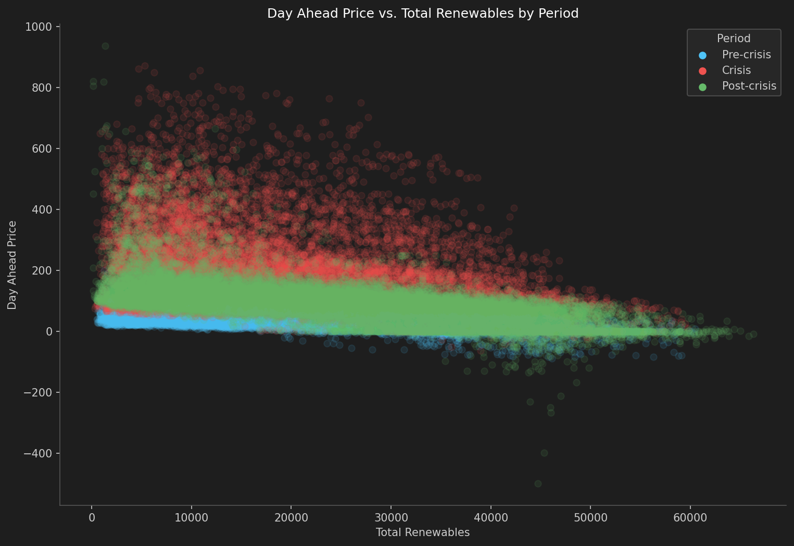
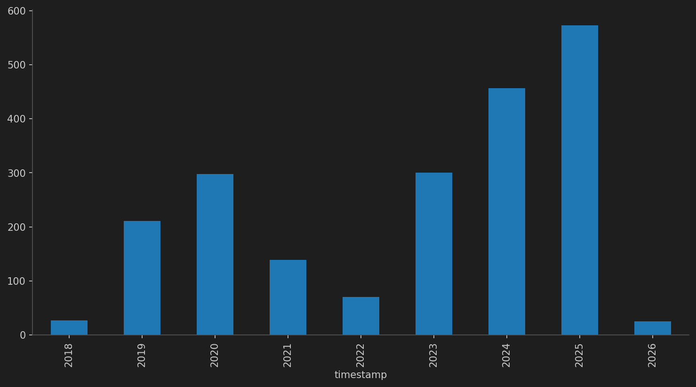
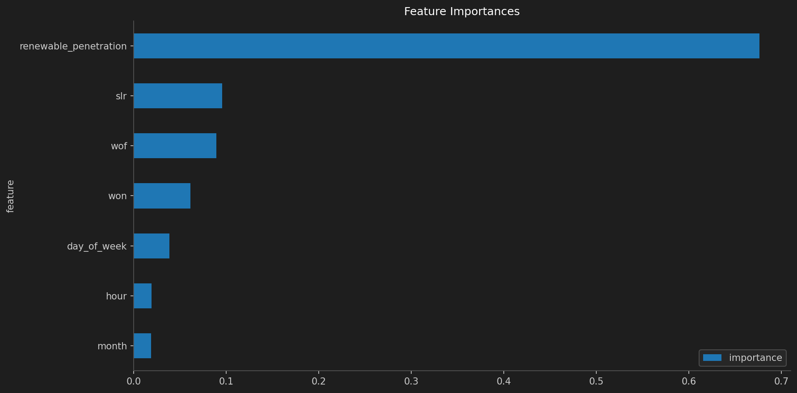

# renewable-price-suppression

Quantifying the merit order effect in German electricity markets using hourly SMARD data (Oct 2018 – Mar 2026). Does higher renewable generation suppress day-ahead prices — and has that effect changed post-energy crisis?

---

## Key Findings

| Finding | Number |
|---|---|
| Price suppression per 0.1 unit renewable penetration increase | **€12.83/MWh** |
| Energy crisis price premium (gas supply shock) | **+€122/MWh** |
| Merit order effect pre-crisis | **−65.78 €/MWh per unit penetration** |
| Merit order effect post-crisis | **−171.91 €/MWh per unit penetration** |
| Negative price hours (2018–2026) | **2,100 / 65,438 (3.21%)** |
| Gradient boosting recall on 2025–2026 test set | **77% of negative price hours** |

The merit order effect **more than doubled** in strength from pre-crisis to post-crisis — Germany's post-2022 renewable buildout is producing measurably larger price suppression per unit of generation.

---

## Visualisations

### Day-Ahead Price vs. Total Renewables by Period

*The 2022 crisis (red) forms a distinct high-price cluster independent of renewable output. Post-crisis (green) shows the deepest negative prices at lower absolute MW thresholds — consistent with fleet expansion.*

### Negative Price Frequency Over Time

*Negative price hours have increased sharply since 2023, tracking Germany's accelerated renewable capacity additions.*

### Gradient Boosting Feature Importances

*Renewable penetration accounts for 67% of total predictive importance — independently confirming the OLS finding via a non-parametric method.*

---

## Methodology

**Data:** 65,438 hourly observations from SMARD API. Five series: day-ahead price, grid load, solar, wind onshore, wind offshore.

**OLS Regression:** Regresses day-ahead price on renewable penetration with categorical controls for hour, month, day of week, and a crisis dummy. HAC standard errors (Newey-West, 24 lags) correct for autocorrelation (DW = 0.053). Grid load dropped after correlation analysis confirmed severe multicollinearity (condition number 1.54e6 → 29.4 after removal).

**Logistic Regression:** Predicts negative price probability. Marginal effect of renewable penetration: +24.54 percentage points per unit. Pseudo R² = 0.618.

**Gradient Boosting:** Time-based train/test split (training: 2018–2024, test: 2025–2026). F1 score on negative price class: 0.74 vs 0.70 logistic baseline.

---

## Repo Structure

```
smard-merit-order/
  data/               ← gitignored (fetch on first run)
  notebooks/
    final.ipynb       ← full pipeline: fetch → merge → EDA → regression → ML
  figures/            ← saved plot outputs
  README.md
  WRITEUP.md          ← detailed methodology and decision log
  requirements.txt
```

---

## Quickstart

```bash
git clone https://github.com/sohamdeo05/renewable-price-suppression
cd renewable-price-suppression
pip install -r requirements.txt
jupyter notebook notebooks/final.ipynb
```

Data fetching (~30 min, first run only) is skipped automatically if raw files exist.

**Dependencies:** `pandas`, `numpy`, `statsmodels`, `scikit-learn`, `matplotlib`, `requests`, `openpyxl`, `pyarrow`, `scikit-learn`